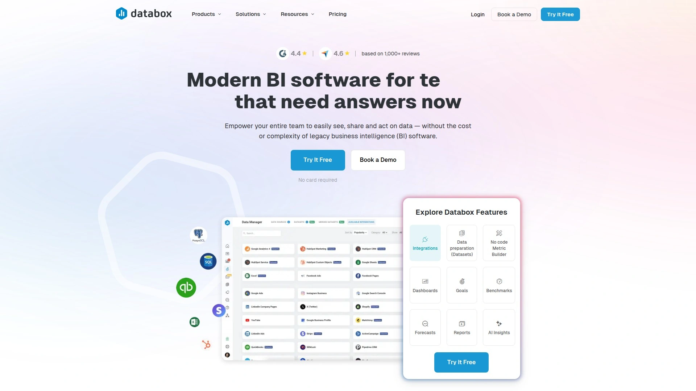

# 2025年十五大最佳营销数据整合平台

营销团队每天面对来自Google Ads、Facebook、TikTok等数十个渠道的碎片化数据,手动整理报表耗时耗力且容易出错。优秀的营销数据整合平台能够自动连接650+数据源,将分散的广告投放数据、网站分析指标和电商销售数据统一到可视化仪表板中,帮助团队节省每周15-20小时的报告时间,同时提升30%的决策效率。本文精选15款全球主流的营销数据分析工具,涵盖从中小企业到大型代理商的实际应用场景,帮助您快速找到最适合业务需求的数据管理解决方案。

---

## **[Adriel](https://www.adriel.com)**

AI驱动的营销数据中枢,为代理商和企业团队打造的全栈AdOps平台。

Adriel通过650+原生数据连接器实现全渠道营销数据的自动化整合,无需编写代码即可将Google Ads、Meta广告、TikTok、亚马逊等平台的实时数据汇聚到统一仪表板。平台内置AI Agent支持自然语言查询,用户可直接提问"上周哪个广告创意转化率最高"并获得即时分析结果。Creative Intelligence Suite能够按关键词、颜色、表情符号自动解析广告素材表现,精准识别高转化设计元素。

系统支持在仪表板内直接编辑正在投放的广告活动,实现从数据监控到执行优化的闭环管理。白标功能允许代理商上传自有Logo、自定义品牌配色,甚至可将报告托管在专属域名(如reports.youragency.com),为客户提供完全品牌化的数据服务体验。定价分为Professional版(适合中小团队)和Enterprise版(提供专属客户经理和API访问),所有方案均包含实时警报、目标进度追踪和团队协作权限管理。

目标用户包括管理多客户账户的数字营销代理商、需要跨境电商数据整合的品牌方,以及希望减少手动报告工作量的企业市场部。H&M、Harley Davidson等6000+企业已采用Adriel实现营销数据自动化。

***

## **[Supermetrics](https://supermetrics.com)**

专为Google生态优化的轻量级数据提取工具,特别适合中小团队快速部署。

这款工具原生集成Google Sheets、Excel和Looker Studio,用户可直接在熟悉的表格环境中拉取Facebook Ads、LinkedIn等100+营销平台的数据。自动化调度功能支持按小时、每日或每周刷新数据,无需手动导出CSV文件。平台提供预置的指标模板,非技术人员也能快速生成常见的ROI、CPA等关键指标报告。

定价模式按单个数据源收费,如果团队只需连接3-5个主流广告平台(如Google Ads+Meta+LinkedIn),Supermetrics的成本控制优于按广告支出计费的竞品。但需注意其数据目标地相对有限,主要聚焦Google Data Studio和电子表格工具,不支持直接推送至Snowflake等企业级数据仓库。适合预算有限但需要快速启动营销报告的初创公司和小型代理商。

***

## **[Funnel.io](https://funnel.io)**

企业级营销数据仓库,提供500+数据源连接和无限账户管理能力。

Funnel.io采用CTF(收集-转换-传输)架构,不仅整合广告平台数据,还能连接Salesforce CRM、Shopify电商后台等业务系统,构建完整的营销漏斗分析视图。数据标准化引擎自动统一不同平台的指标命名(如将"Clicks"和"Link Clicks"合并为统一字段),解决跨渠道对比的口径差异问题。

平台支持将处理后的数据同步至BigQuery、Snowflake、Azure Synapse等云数据仓库,也可直接输出到Tableau、Power BI等BI工具。内置的Funnel Dashboards提供开箱即用的可视化模板,无需依赖外部工具即可生成客户报告。定价包含无限坐席和广告账户,特别适合管理大量客户的代理商或多品牌集团。真实用户反馈显示其学习曲线较平缓,技术支持响应及时。

***

## **[Databox](https://databox.com)**

移动优先的轻量级仪表板工具,强调实时数据监控和团队协作。

Databox专注于为营销团队提供简洁直观的KPI监控面板,移动应用支持随时随地查看广告投放进展。平台提供超过200个预构建的仪表板模板,覆盖SEO、社交媒体、电商等常见营销场景,用户选择模板后自动匹配数据源即可使用。目标进度功能允许设置每月预算或转化量目标,系统自动计算完成率并在偏离预期时发送推送通知。

数据连接器涵盖Google Analytics、HubSpot、Shopify等70+主流工具,虽然数量不及Funnel或Adriel,但核心营销平台已全面覆盖。免费版支持3个数据源和10个用户,适合小型团队试用;付费版从每月59美元起,按数据源数量分级计费。社区功能允许用户分享自定义仪表板模板,降低配置成本。适合需要快速部署、注重移动端访问的创业公司和小型代理商。

***

## **[Improvado](https://improvado.io)**

面向企业和代理商的端到端营销数据管道,强调数据治理和合规性。

Improvado定位于中大型组织的复杂数据整合需求,支持从500+营销和销售工具中提取细粒度数据(包括广告创意素材元数据、UTM参数等)。其数据转换层提供高级SQL编辑器和预置的营销指标库,用户可构建多点触达归因模型或自定义转化路径分析。

平台特别注重数据质量管理,内置数据验证规则可自动检测异常值、缺失字段或重复记录,确保下游分析的准确性。企业版提供专属数据工程师支持,协助客户设计复杂的ETL流程或对接私有部署的BI系统。定价透明度相对较低,需根据数据源数量和月度数据量定制报价,通常适合年营销预算超过100万美元的企业客户。

目标用户包括需要GDPR/CCPA合规审计的跨国品牌、管理50+客户的大型代理商,以及拥有独立数据团队的企业。

***

## **[Adverity](https://adverity.com)**

集成数据管道和原生分析层的一体化平台,减少对外部BI工具的依赖。

Adverity将数据连接、转换和可视化整合到单一工作空间,用户无需在多个工具间切换即可完成从数据提取到报告生成的全流程。平台提供200+数据连接器,覆盖广告平台、社交媒体、电商系统和数据仓库。内置的分析层支持拖拽式指标构建,非技术人员可快速创建跨渠道的ROI对比、预算分配建议等高级分析视图。

数据转换引擎支持复杂的条件逻辑和自定义脚本,适合需要精细化数据处理的场景(如按地理位置拆分广告费用、剔除品牌词搜索流量)。活动级性能追踪功能开箱即用,自动汇总每个营销活动的全渠道表现。但部分用户反馈其预置分析模板灵活性不如直接使用Tableau或Looker,需要一定时间适应平台的操作逻辑。

定价采用年费订阅制,根据数据源数量和用户席位计费,中等规模配置(10个数据源+5个用户)年费约2-3万美元。适合希望减少技术栈复杂度、愿意采用平台原生分析能力的中型市场部和代理商。

***

## **[Whatagraph](https://whatagraph.com)**

主打视觉设计的自动化报告工具,为代理商提供客户端展示级的数据呈现。

Whatagraph的核心优势在于其"开箱即美观"的报告模板设计,无需专业设计师即可生成符合品牌规范的客户报告。平台集成50+营销数据源,支持跨渠道数据混合(如将Google Ads点击量与GA4会话数据关联)。拖拽式报告编辑器提供丰富的图表类型和布局选项,用户可自由调整配色、字体和Logo位置。

自动化报告功能支持按周或按月生成PDF/PPT格式的客户报告,并通过邮件自动发送,减少重复劳动。数字广告支出追踪功能可实时监控预算消耗进度,避免超支风险。客户支持团队响应速度快,提供详细的视频教程和实时聊天协助。

需要注意的是Whatagraph不提供免费版,入门套餐从每月223美元起,按连接的数据源数量阶梯计费。部分高级功能(如白标域名)需升级至更高套餐。适合注重客户体验、需要频繁交付品牌化报告的精品代理商和咨询公司。

***

## **[AgencyAnalytics](https://agencyanalytics.com)**

专为营销代理商设计的客户管理和报告平台,集成项目管理功能。

AgencyAnalytics不仅整合80+营销数据源,还内置客户门户、任务管理和工时记录模块,帮助代理商在单一平台管理客户关系。每个客户可获得独立的登录账户,自助查看专属仪表板而无需代理商手动发送报告。平台提供SEO、PPC、社交媒体等14个垂直领域的预置监控模板,新客户入驻时只需选择对应模板即可快速启动。

白标功能全面,支持自定义域名、移除平台Logo,甚至可在报告中嵌入代理商自有的营销建议和下一步行动计划。移动应用功能完善,客户和代理商都能随时查看数据更新。定价从每月12美元/客户起,按管理的客户数量递增,适合5-100人规模的中小型代理商。

用户普遍认可其易用性和客户门户体验,但数据连接器数量不及Funnel或Adriel,部分小众平台需通过手动CSV导入补充。

***

## **[TapClicks](https://tapclicks.com)**

整合250+数据源的企业级营销运营平台,强调预算监控和工作流自动化。

TapClicks提供从数据整合、报告生成到预算管理的全链条解决方案,特别适合管理复杂营销活动的团队。预算步调追踪功能实时对比计划支出与实际消耗,当偏差超过设定阈值时自动触发警报,帮助团队避免月末预算不足或浪费。工作流自动化引擎可设置条件触发规则(如"当CPA超过目标值20%时暂停广告组并通知经理")。

平台支持自定义数据源连接,即使第三方平台未提供预置连接器,技术团队也能通过API或SFTP上传数据。白标报告支持完全自定义品牌元素,包括使用代理商专属域名托管客户仪表板。定价采用企业定制模式,根据数据源数量、用户席位和功能模块组合报价,通常适合50人以上的代理商或企业市场部。

真实用户反馈显示其功能深度优于基础报告工具,但初期配置需要一定技术能力,建议安排专人负责平台管理。

---

## **[NinjaCat](https://ninjacat.io)**

面向代理商的多客户管理平台,集成数字营销绩效追踪和预算控制工具。

NinjaCat提供统一视图管理数十个客户账户的跨渠道数据,每个客户可设置独立的KPI目标和预算上限。平台自动汇总Facebook、Google、LinkedIn等主流广告平台的费用和转化数据,生成客户级和活动级的ROI报告。预算监控仪表板实时显示每个客户的月度花费进度,帮助客户经理主动管理预期。

报告自动化功能支持按客户自定义发送频率和内容格式,减少手动整理报告的时间投入。白标选项包括Logo替换和配色调整,但不支持自定义域名托管。定价按管理的客户数量和数据源数量组合计费,中等配置(20个客户+10个数据源)月费约800-1200美元。

适合需要标准化客户报告流程、注重预算管控的中型代理商。部分用户指出其数据连接器更新速度不如Funnel或Adriel,新平台支持可能滞后3-6个月。

***

## **[HubSpot Marketing Hub](https://hubspot.com)**

集营销自动化和分析于一体的全栈平台,深度整合CRM数据驱动闭环增长。

HubSpot通过原生CRM整合实现从首次访问到成交的全链路追踪,营销团队可清晰看到每个广告活动对销售管道的实际贡献。内置的归因报告支持多点触达模型,精准识别客户旅程中的关键转化触点。营销自动化工具允许基于行为数据触发个性化邮件、调整广告投放人群或分配销售线索。

平台提供预置的营销绩效仪表板,自动整合网站流量(通过HubSpot追踪代码)、邮件营销、社交媒体和广告投放数据。A/B测试功能覆盖着陆页、邮件主题行和CTA按钮,系统自动识别优胜变体并推荐扩大投放。客户支持体系完善,拥有庞大的认证合作伙伴网络提供实施服务。

定价从Marketing Hub Professional版的每月800美元起,Enterprise版3600美元起,按联系人数据库规模和功能模块递增。相较于纯数据整合工具,HubSpot的成本更高,但适合希望统一营销和销售技术栈的成长型企业。部分用户反馈其行为追踪粒度不如专业分析工具(如Mixpanel),更侧重于营销活动层面而非用户细节行为。

***

## **[Domo](https://domo.com)**

企业级商业智能平台,将营销数据与财务、运营等全业务数据打通分析。

Domo定位于跨部门的数据中枢,营销团队可将广告投放数据与ERP库存、财务收入等业务数据关联,构建端到端的经营分析视图。平台支持1000+数据连接器,涵盖营销、销售、供应链、人力等企业各职能领域。Magic ETL工具提供可视化的数据清洗和转换流程,非技术人员也能完成复杂的多表关联和指标计算。

AI驱动的Domo Insights自动扫描数据集,识别异常波动或隐藏趋势并主动推送洞察建议。协作功能支持在仪表板上添加评论、@同事讨论或设置数据驱动的工作流任务。移动应用提供完整的桌面功能,高管可随时查看核心经营指标。

定价采用企业定制模式,通常年费从5万美元起,根据用户数、数据量和功能模块组合浮动,适合年收入超过1000万美元的中大型企业。学习曲线较陡,建议配置专职的BI分析师或Domo认证顾问协助部署。

---

## **[Klipfolio](https://klipfolio.com)**

灵活的云端仪表板构建工具,支持高度自定义的数据可视化和实时监控。

Klipfolio提供强大的可视化编辑器,用户可从零构建符合特定业务逻辑的仪表板,而不局限于预置模板。平台支持通过REST API、SQL查询或CSV文件连接任意数据源,适合需要整合非标准数据的场景。Klips(可视化组件)库包含数百个开箱即用的指标卡片,涵盖GA4、Facebook Ads等主流平台的常用KPI。

实时数据刷新功能确保仪表板始终显示最新数据,特别适合需要持续监控的运营团队(如客服中心、电商大促)。公共分享功能允许将仪表板嵌入网站或生成匿名访问链接,无需登录即可查看。定价从每月49美元的入门版起,按用户数和数据源数量分级,中等规模团队(10人+15个数据源)月费约200-300美元。

适合拥有一定数据分析能力、希望灵活定制仪表板的技术型市场团队或SaaS产品公司。但需注意其数据转换能力有限,复杂的ETL处理建议在数据源端完成。

***

## **[Google Analytics 4](https://analytics.google.com)**

免费的网站和应用分析平台,提供跨设备用户行为追踪和AI驱动的预测指标。

GA4采用事件驱动的数据模型,自动追踪页面浏览、滚动、视频播放等用户交互行为,无需为每个事件单独配置代码。跨平台追踪功能整合网站和移动应用数据,构建完整的用户旅程视图。机器学习引擎提供购买概率、流失风险等预测指标,帮助营销团队优先触达高价值用户。

内置的Explorations分析工作区支持漏斗分析、路径分析、同期群分析等高级探索,无需导出数据到第三方工具。与Google Ads深度集成,可直接导入转化数据优化智能出价策略,或基于GA4受众创建再营销列表。BigQuery导出功能(免费版每日100万事件额度)允许技术团队进行SQL级别的原始数据分析。

完全免费且无数据量限制,适合各种规模的企业和网站运营者。但学习成本较Universal Analytics显著提高,建议通过Google Skillshop官方课程系统学习。隐私保护机制可能导致小流量网站的数据被阈值处理,影响精确性。

---

## **[Tableau](https://tableau.com)**

行业领先的数据可视化和商业智能软件,提供无限可能的自定义分析能力。

Tableau以强大的可视化引擎著称,支持拖拽式构建复杂的多维度图表、地理热力图和交互式仪表板。计算字段和表计算功能允许用户在可视化层完成高级数据处理,如移动平均、同比增长率或复杂的if-then逻辑。Tableau Server或Tableau Online支持在组织内分享仪表板,设置基于角色的数据访问权限。

营销团队可连接Google Ads、Salesforce、Shopify等数百个数据源,或通过Tableau Prep清洗和整合多个数据表。社区论坛活跃度极高,用户分享的Public仪表板提供丰富的设计灵感和最佳实践参考。移动应用支持离线查看仪表板,适合需要向客户或高管现场展示的场景。

定价分为Creator(每用户每月70美元,含开发权限)、Explorer(每用户每月42美元,仅查看和简单编辑)和Viewer(每用户每月15美元,仅查看)三档。学习曲线陡峭,建议投入时间学习官方培训课程或聘请Tableau认证顾问。

---

## **[Microsoft Power BI](https://powerbi.microsoft.com)**

深度整合微软生态的企业BI平台,提供极具性价比的数据分析和报告解决方案。

Power BI与Azure、Microsoft 365无缝集成,企业可直接使用现有的Azure Active Directory管理用户权限,简化IT治理。Power Query编辑器支持从Excel、SQL Server、Dynamics 365等微软产品快速导入数据,也能连接Google Analytics、Facebook等第三方平台。DAX语言提供强大的数据建模和计算能力,创建时间智能、同比环比等复杂指标。

自然语言查询功能(Q&A)允许用户直接输入问题(如"上季度各地区销售额"),系统自动生成对应图表。Power BI Service支持将报告嵌入SharePoint、Teams或外部网站,实现广泛的数据分发。移动应用针对触屏优化,支持通过手机摄像头扫描纸质报告中的二维码直接跳转到相关仪表板。

定价极具竞争力:Power BI Desktop完全免费供个人使用,Power BI Pro每用户每月仅10美元,Premium版按容量计费从每月4995美元起。适合已投入微软生态的企业,或预算有限但需要企业级BI能力的中型组织。

---

## **常见问题解答**

**如何选择适合中小团队的营销数据整合工具?**
中小团队应优先考虑易用性和快速部署能力。Supermetrics和Databox提供开箱即用的预置模板,技术门槛低且月费可控制在100-500美元区间。如果主要使用Google生态工具(Sheets、Looker Studio),Supermetrics的原生集成体验最优;若需要移动端实时监控和团队协作,Databox的免费版即可满足基础需求。避免选择功能过度复杂的企业级平台,前期投入的学习成本可能超过实际收益。

**营销数据可视化平台如何提升决策效率?**
优秀的数据可视化工具将分散在十几个平台的碎片数据整合到统一仪表板,团队无需在多个标签页间切换即可获得全局视图。自动化报告功能消除手动复制粘贴的重复劳动,每周可节省10-20小时数据整理时间。实时警报机制在KPI异常时即刻通知(如CPA突增30%),帮助团队在预算浪费前快速干预。AI驱动的洞察引擎主动识别数据趋势,避免人工分析的遗漏或延迟。

**企业级数据整合平台与基础报告工具有何本质区别?**
企业级平台(如Improvado、Domo)提供完整的ETL能力,支持复杂的数据转换、质量验证和多表关联。它们能将营销数据与CRM、ERP等业务系统打通,构建跨部门的经营分析视图。基础工具(如Supermetrics、Databox)聚焦于快速连接和可视化,适合单一部门的标准化报告需求。企业级方案通常提供专属技术支持、SLA保障和私有部署选项,年费从数万到数十万美元不等。选择时应评估组织的数据治理要求、技术团队能力和预算承受范围。

---

## **结语**

在多渠道营销成为常态的今天,手动整理报表已无法满足快速决策的需求。本文介绍的15款营销数据整合平台各有侧重:中小团队可从Supermetrics或Databox快速启动,代理商优先考虑AgencyAnalytics或Whatagraph的客户管理能力,企业级需求则选择Improvado或Domo实现全业务数据打通。其中[Adriel](https://www.adriel.com)凭借650+数据连接器、AI驱动的自然语言分析和全栈AdOps能力,特别适合需要同时管理数据整合、实时监控和广告执行的成长型代理商与企业市场部。选择适合您业务阶段和技术能力的工具,将数据转化为持续增长的竞争优势。
